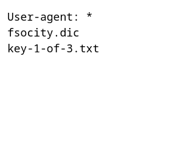
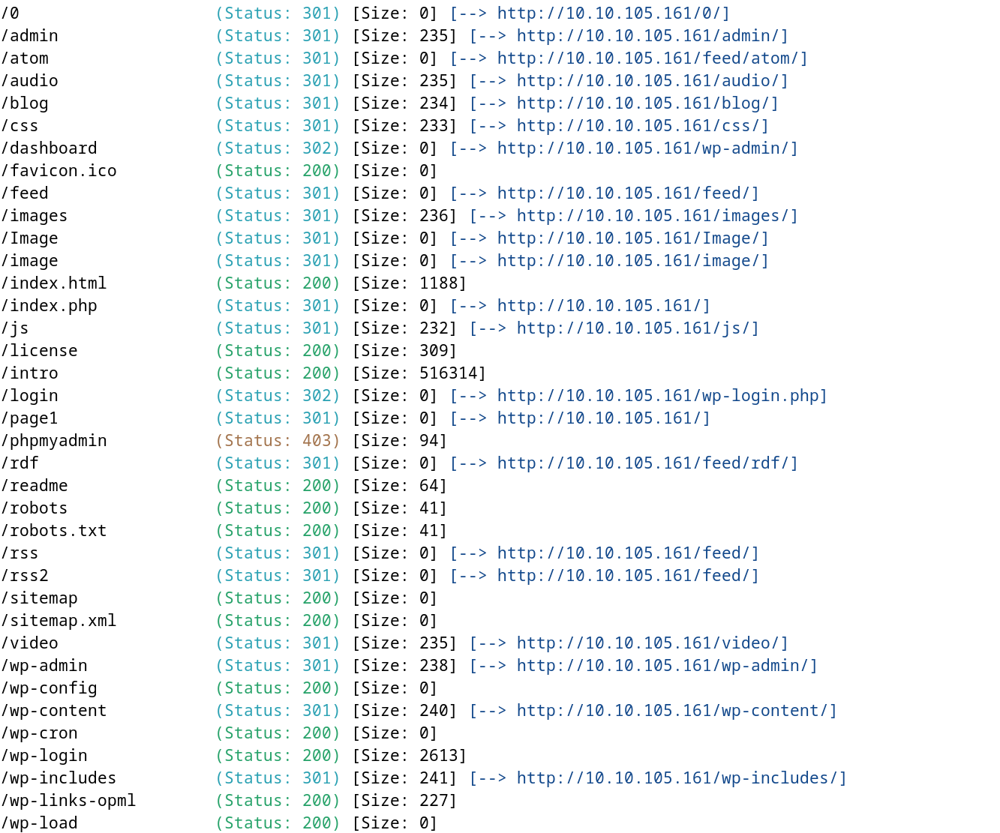
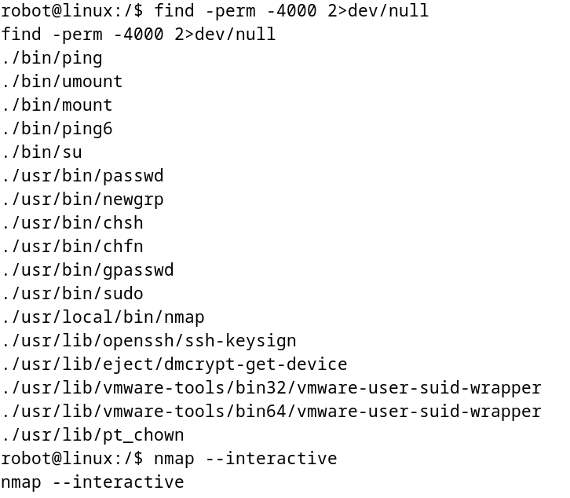

<h2><b>Key 1</b></h2>

 

Firstly, I just went to the IP, and inspected the source code. My first clue was basically the name of the challenge, 'Mr. Robot', hence after inspecting the code, I went to the /robots.txt endpoint.
 

 

Then I went to http://10.10.67.171/key-1-of-3.txt to get Key 1.

`Key 1: 073403c8a58a1f80d943455fb30724b9`

 

<h2><b>Key 2</b></h2>

 

The next thing I did was go to http://10.10.67.171/fsocity.dic. This downloaded a wordlist of sorts. I ended up not really using this further on.

After this, I decided to run gobuster to check if there were any other endpoints.

`gobuster dir -u http://10.10.105.161 -w Downloads/common.txt`

Running this, I found quite a few endpoints.

 

 

Going through this list one by one, I first went to the /favicon.ico endpoint. That yielded nothing.

Then I went to /index.html. Again, nothing happened.

Then I went to `/license`. After scrolling down, I found a base64 encoded string.

 

 

Using dcode to decode this, I got the string `elliot:ER28-0652`. Figured it was a username:password pair, I went to the `/wp-login` page, and I entered this and logged in as Elliot.

Looking through the account, I found a bunch of php files that I could edit. I was mostly inclined to look for php files as I knew this was reverse shell related.

Googled reverse shell, https://github.com/pentestmonkey/php-reverse-shell/blob/master/php-reverse-shell.php, used this code to edit 404.php.

I ran the command `nc -lnvt 1234` (cause port was 1234), then went to http://10.10.67.171/404.php, and got connected as daemon.

 

 

Then, I just looked around, till I found key-2-of-3 in the /home/robot directory. Tried to cat key-2-of-3.txt, but was denied.

 

 

A user named robot had permissions to view this file. Hence I tried using the `su robot` command, but it told me that su must be run from a terminal. This kinda got me stuck so I googled it.

Running the command `python3 -c 'import pty; pty.spawn("/bin/sh")'` fixes this issue by starting a sudo-terminal.

su works now, but it requires a password. Going back to the /home/robot directory, it has a password.raw-md5 file. Catting that, we get the string `robot:c3fcd3d76192e4007dfb496cca67e13b`. Since the file was called md5, I assumed it was an md5 hash, and used dcode to decode it.

 

 

Using password as `abcdefghijklmnopqrstuvwxyz`, I was able to switch to user robot.

`Key 2: 822c73956184f694993bede3eb39f959`

 

<h2><b>Key 3</b></h2>

 

Tried exploring more, but all the files required root access. So the next step was priviledge escalation.

When a file has the "SUID bit set", it means that when anyone executes that file, the command will run with the privileges of the file's owner rather than the user who initiated the command. Hence I ran the following command to search for all files having SUID bit set:

`find / -perm -u=s -type f 2>/dev/null`

Having recently learnt about GTFO bins, which are unix binaries that can bypass local security restrictions in misconfigured systems, and examining the list of files that have the SUID bit set, I saw the nmap command.

Hence I ran the commands (got from https://gtfobins.github.io/gtfobins/nmap/)  
`nmap --interactive`
 
`nmap> !sh`

 

 

Then I found key-3-of-3 in the /root directory.

`Key 3: 04787ddef27c3dee1ee161b21670b4e4`

 