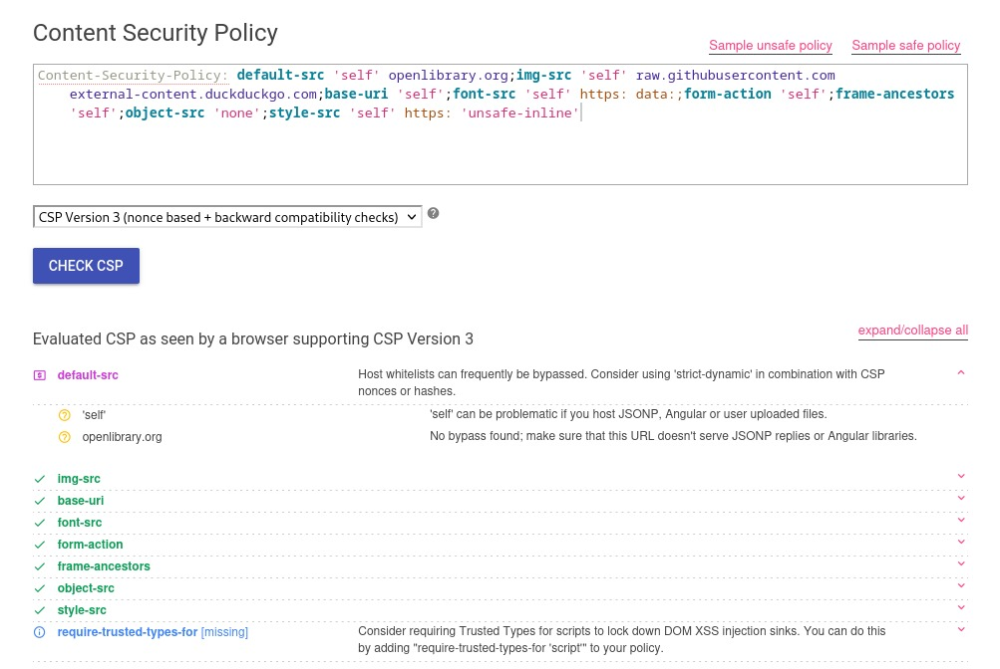

We were given a website to explore. Due to the hint, the first thing I did was enter a random username and password, and intercept the request using BurpSuite. Examining it, I saw

    Content-Security-Policy: default-src 'self' openlibrary.org;img-src 'self' raw.githubusercontent.com external-content.duckduckgo.com;base-uri 'self';font-src 'self' https: data:;form-action 'self';frame-ancestors 'self';object-src 'none';style-src 'self' https: 'unsafe-inline'

Referring to https://book.hacktricks.xyz/pentesting-web/content-security-policy-csp-bypass, the first vulnerability that caught my eye was the 'unsafe-inline'. Hence I tried the payload given to try to find a way to login as admin, but that did not work.

I used https://csp-evaluator.withgoogle.com to evaluate the CSP and find any vulnerabilities.

Seeing the openlibrary.org url, I thought of making using of JSONP replies. I did not understand how exactly to make use of that, so I moved on to the next thing, which was Third-Party Abuse.

Our CSP had 'default-src 'self' openlibrary.org;' which made me think of exploiting using this method. I will look into this in the future.

Later, I registered and opened the content of the main website. We were given 5 random books, and there was an add book option. I tried random payloads to check for XSS, and it was XSS vulnerable. I just played along with that and tried to understand the specifics behind the payloads.

I think I need to explore Third-Party-Abuse and JSONP further. Also, will try to find other methods to exploit.